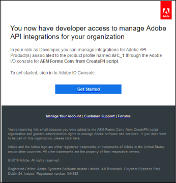
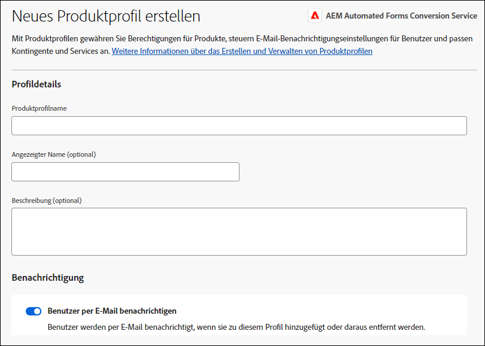
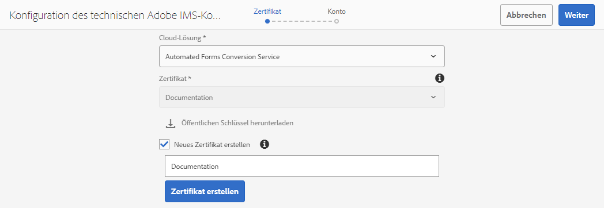
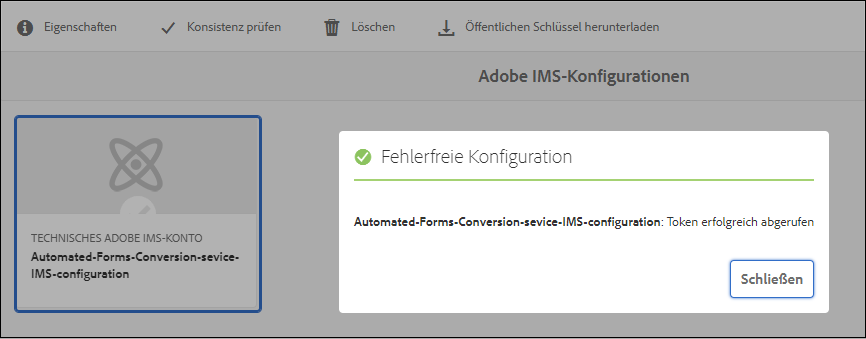

# Service für die automatisierte Formularkonvertierung konfigurieren {#about-this-help}

In dieser Hilfe wird beschrieben, wie ein AEM-Administrator den Service für die automatisierte Formularkonvertierung konfigurieren kann, um die Konvertierung von PDF-Formularen in adaptive Formulare zu automatisieren. Diese Hilfe richtet sich an IT- und AEM-Administratoren in Ihrem Unternehmen. Benutzer dieser Hilfe sollten mit den folgenden Technologien vertraut sein:

* Installieren, Konfigurieren und Verwalten von Adobe Experience Manager- und AEM-Paketen,

* Verwenden von Linux®- und Microsoft® Windows®-Betriebssystemen,

* Konfigurieren von SMTP-Mailservern

<!--- >[!VIDEO](https://video.tv.adobe.com/v/29267/) 

**Watch the video or read the article to configure Automated Forms Conversion service** -->

## Einstieg {#onboarding}

Der Service steht Kunden von AEM 6.4 Forms und AEM 6.5 Forms On-Premise sowie Unternehmenskunden von Adobe Managed Service kostenlos zur Verfügung. Sie können sich an das Adobe Sales-Team oder Ihren Adobe-Support-Mitarbeiter wenden, um Zugriff auf den Service anzufordern. Der Service ist auch für Kunden von AEM Forms as a Cloud Service kostenlos und verfügbar und vorkonfiguriert.

Adobe ermöglicht den Zugriff für Ihre Organisation und stellt der in Ihrer Organisation als Administrator genannten Person die erforderlichen Berechtigungen zur Verfügung. Der Administrator kann den AEM Forms-Entwicklern (Benutzern) Ihrer Organisation Zugriff gewähren, um eine Verbindung zum Service herzustellen.

## Voraussetzungen {#prerequisites}

Für die Verwendung des Service für die automatisierte Formularkonvertierung ist Folgendes erforderlich:

* Der Service für die automatisierte Formularkonvertierung muss für Ihre Organisation aktiviert sein
* Ein Adobe ID-Konto mit Administratorrechten für den Konvertierungs-Service
* Eine betriebsbereite AEM 6.4-, AEM 6.5- oder AEM Forms as a Cloud Service-Autoreninstanz mit dem neuesten AEM Service Pack oder den neuesten Aktualisierungen.
* Ein AEM-Benutzer (in Ihrer AEM-Instanz), der Mitglied der Gruppe „forms-user“ ist

## Einrichten der Umgebung {#setuptheservice}

Bereiten Sie vor der Verwendung des Service Ihre AEM-Autoreninstanz für die Verbindung mit dem in Adobe Cloud ausgeführten Service vor. Führen Sie die folgenden Schritte in der angegebenen Reihenfolge aus, um Ihre Instanz für den Service vorzubereiten:

1. [Herunterladen und Installieren von AEM 6.4, AEM 6.5 oder Einstieg in AEM Forms as a Cloud Service](#aemquickstart)
1. [Laden Sie das aktuelle AEM Service Pack herunter und installieren Sie es](#servicepack)
1. [Herunterladen und Installieren des neuesten Add-On-Pakets für AEM Forms](#downloadaemformsaddon)
1. (Optional) [Laden Sie das neueste Connector-Paket herunter und installieren Sie es](#installConnectorPackage)
1. [Erstellen benutzerdefinierter Designs und Vorlagen](#referencepackage)

### Herunterladen und Installieren von AEM 6.4 oder AEM 6.5 oder Einstieg in AEM Forms as a Cloud Service {#aemquickstart}


Der Service für die automatisierte Formularkonvertierung wird in der AEM-Autoreninstanz ausgeführt. Sie benötigen AEM 6.4, AEM 6.5 oder AEM Forms as a Cloud Service, um eine AEM-Autoreninstanz einzurichten.

* Wenn Sie AEM 6.4 bzw. AEM 6.5 nicht eingerichtet haben, laden Sie es von den unten aufgeführten Speicherorten herunter. Anweisungen zum Einrichten einer AEM-Autoreninstanz finden Sie nach dem Herunterladen von AEM unter [Bereitstellen und Verwalten](https://helpx.adobe.com/de/experience-manager/6-5/sites/deploying/using/deploy.html#defaultlocalinstall).

   * Wenn Sie bereits ein AEM-Kunde sind, laden Sie AEM 6.4 oder AEM 6.5 von der [Adobe Licensing Website](http://licensing.adobe.com) herunter.

   * Wenn Sie ein Adobe-Partner sind, fordern Sie über das [Adobe Partner Training Program](https://adobe.allegiancetech.com/cgi-bin/qwebcorporate.dll?idx=82357Q) AEM 6.4 oder AEM 6.5 an.

* Wenn Sie AEM Forms as a Cloud Service verwenden, machen Sie sich mit dem Einstieg in [AEM Forms as a Cloud Service](https://experienceleague.adobe.com/docs/experience-manager-forms-cloud-service/forms/setup-environment/setup-forms-cloud-service.html?lang=de#setup-environment) und dem [Einrichten einer lokalen Entwicklungsumgebung](https://experienceleague.adobe.com/docs/experience-manager-forms-cloud-service/forms/setup-environment/setup-local-development-environment.html?lang=de#setup-environment) vertraut.

### (Nur für AEM 6.4 und AEM 6.5) Herunterladen und Installieren des aktuellen AEM Service Pack {#servicepack}

Laden Sie das aktuelle AEM Service Pack herunter und installieren Sie es. Ausführliche Anweisungen finden Sie unter  oder [Versionshinweise zu AEM 6.4 Service Pack](https://helpx.adobe.com/de/experience-manager/6-4/release-notes/sp-release-notes.html) bzw. [Versionshinweise zu AEM 6.5 Service Pack](https://helpx.adobe.com/de/experience-manager/6-5/release-notes/sp-release-notes.html).

### (Nur für AEM 6.4 und AEM 6.5) Herunterladen und Installieren des AEM Forms-Add-On-Pakets  {#downloadaemformsaddon}

Eine AEM-Instanz enthält grundlegende Formularfunktionen. Der Konvertierungs-Service erfordert sämtliche Funktionen von AEM Forms. Laden Sie das AEM Forms-Add-On-Paket herunter und installieren Sie es, um alle Funktionen von AEM Forms nutzen zu können. Das Paket ist erforderlich, um den Konvertierungs-Service einzurichten und auszuführen. Detaillierte Anweisungen finden Sie unter [Installieren und Konfigurieren von Datenerfassungsfunktionen](https://helpx.adobe.com/de/experience-manager/6-5/forms/using/installing-configuring-aem-forms-osgi.html).

>[!NOTE]
> Stellen Sie sicher, dass Sie nach der Installation des Add-On-Pakets die obligatorischen Konfigurationen nach der Installation durchführen.
>

<!-- ### (Optional) Download and install connector package  {#installConnectorPackage}

The connector package provides early access to the [Auto-detect logical sections](convert-existing-forms-to-adaptive-forms.md#run-the-conversion) features and improvements delivered in release AFC-2020.03.1. Do not install the package if you do not require feature and improvements delivered in AFC-2020.03.1.  You can [download the connector package from AEM Package Share](https://www.adobeaemcloud.com/content/marketplace/marketplaceProxy.html?packagePath=/content/companies/public/adobe/packages/cq650/featurepack/AFCS-Connector-2020.03.1). -->


### Erstellen benutzerdefinierter Designs und Vorlagen {#referencepackage}

Wenn Sie AEM 6.4 oder AEM 6.5 im [Produktionsmodus](https://helpx.adobe.com/de/experience-manager/6-5/sites/administering/using/production-ready.html) (Ausführungsmodus „nosamplecontent“) starten, werden die Referenzpakete nicht installiert. Die Referenzpakete enthalten Beispiel-Designs und -vorlagen. Für den Service für die automatisierte Formularkonvertierung sind mindestens ein Design und eine Vorlage erforderlich, um ein PDF-Formular in ein adaptives Formular zu konvertieren. Erstellen Sie ein eigenes benutzerdefiniertes Design und eine eigene Vorlage und verweisen Sie auf die [Service-Konfiguration](#configure-the-cloud-service), um benutzerdefinierte Vorlagen und Designs zu verwenden, bevor Sie den Service verwenden.

Sie können das Paket [AEM Forms Reference Assets](https://experience.adobe.com/#/downloads/content/software-distribution/en/aemcloud.html) auch in Ihre Autoreninstanz herunterladen und dort installieren. Es werden einige Referenz-Designs und -vorlagen erstellt.

## Konfigurieren des Service {#configure-the-service}

Bevor Sie mit der Konfiguration des Service fortfahren und Ihre lokale Instanz mit dem in Adobe Cloud ausgeführten Service verbinden, sollten Sie sich über die Personen und Berechtigungen informieren, die für die Verbindung mit dem Service erforderlich sind. Der Service verwendet zwei verschiedene Arten von Personen: Administratoren und Entwickler:

* **Administratoren**: Administratoren sind für die Verwaltung der Adobe-Software und -Services für ihre Organisation verantwortlich. Administratoren gewähren Entwicklern in ihrer Organisation Zugriff zur Herstellung einer Verbindung zum Service für die automatisierte Formularkonvertierung, der in Adobe Cloud ausgeführt wird. Wenn ein Administrator für eine Organisation bereitgestellt wird, erhält der Administrator eine E-Mail mit dem Titel **[!UICONTROL Sie haben jetzt Administratorrechte zur Verwaltung von Adobe-Software und -Services für Ihre Organisation]**. Wenn Sie Administrator sind, überprüfen Sie Ihr Postfach auf E-Mails mit dem oben genannten Titel und fahren Sie fort mit dem [Gewähren des Zugriffs für Entwickler Ihrer Organisation](#adduseranddevs).


* **Entwickler**: Ein Entwickler verbindet eine lokale AEM Forms-Autoreninstanz mit dem Service für die automatisierte Formularkonvertierung, der in Adobe Cloud ausgeführt wird. Wenn ein Administrator einem Entwickler Rechte zum Herstellen einer Verbindung zum Service für die automatisierte Formularkonvertierung gewährt, wird eine E-Mail mit dem Titel „Sie haben jetzt Entwicklerzugriff zum Verwalten der Adobe API-Integrationen für Ihr Unternehmen“ an den Entwickler gesendet. Wenn Sie Entwickler sind, überprüfen Sie Ihr Postfach auf E-Mails mit dem oben genannten Titel und fahren Sie mit dem [Verbinden Ihrer lokalen AEM-Instanz mit dem Service für die automatisierte Formularkonvertierung in Adobe Cloud](#connectafcadobeio) fort.



### (Nur für Administratoren von AEM 6.4 und AEM 6.5) Entwicklern Ihrer Organisation Zugriff gewähren {#adduseranddevs}

Nachdem Adobe den Zugriff für Ihr Unternehmen aktiviert und dem Administrator die erforderlichen Berechtigungen erteilt hat, kann sich der Administrator bei der Admin Console anmelden (detaillierte Anweisungen unten), ein Profil erstellen und Entwickler zum Profil hinzufügen. Entwickler können eine lokale Instanz von AEM Forms mit dem Service für die automatisierte Formularkonvertierung in Adobe Cloud verbinden.

Entwickler sind Mitglieder Ihrer Organisation, die den Konvertierungs-Service ausführen. Nur Entwickler, die dem Service-Profil für die automatisierte Formularkonvertierung von Adobe hinzugefügt wurden, sind berechtigt, den Service für die automatisierte Formularkonvertierung zu verwenden. Führen Sie die folgenden Schritte aus, um ein Profil zu erstellen und ihm Entwickler hinzuzufügen. Es ist mindestens ein Profil erforderlich, um Entwicklern Ihres Unternehmens den erforderlichen Zugriff zu gewähren:

1. Melden Sie sich bei [Admin Console](https://adminconsole.adobe.com/) an. Melden Sie sich mit der **Adobe ID** des für die Verwendung des Service für die automatisierte Formularkonvertierung bereitgestellten Administrators an. Verwenden Sie keine andere ID oder Federated ID, um sich anzumelden.
1. Klicken Sie auf die Option **[!UICONTROL Automatisierte Formularkonvertierung]**.
1. Klicken Sie auf **[!UICONTROL Neues Profil]** auf der Registerkarte **[!UICONTROL Produkte]**.
1. Geben Sie **[!UICONTROL Name]**, **[!UICONTROL Anzeigename]** und **[!UICONTROL Beschreibung]** für das Profil an. Klicken Sie auf **[!UICONTROL Fertig]**. Ein Profil wird erstellt.

   

1. Fügen Sie Entwickler zum Profil hinzu. Hinzufügen der Entwickler:
   1. In der [Admin Console](https://adminconsole.adobe.com/enterprise), wechseln Sie zur Registerkarte „Übersicht“.
   1. Klicken Sie auf der gewünschten Produktkarte auf **[!UICONTROL Entwickler zuweisen]**.
   1. Geben Sie die E-Mail-Adresse des Entwicklers sowie optional den Vor- und Nachnamen ein.
   1. Wählen Sie „Produktprofile“. Tippen Sie auf **[!UICONTROL Speichern]**.

Wiederholen Sie die obigen Schritte für alle Benutzer. Weitere Informationen zum Hinzufügen von Entwicklern finden Sie unter [Entwickler verwalten](https://helpx.adobe.com/de/enterprise/using/manage-developers.html).

Sobald ein Administrator Entwickler zum Adobe I/O-Profil hinzufügt, werden die Entwickler per E-Mail benachrichtigt. Nach Erhalt der E-Mail können die Entwickler eine [lokale AEM Forms-Instanz mit dem Service für die automatisierte Formularkonvertierung in Adobe Cloud verbinden](#connectafcadobeio).

### (Nur für Entwickler) Verbinden Ihrer lokalen AEM Forms-Instanz mit dem Service für die automatisierte Formularkonvertierung in Adobe Cloud {#connectafcadobeio}

Nachdem ein Administrator Ihnen Entwicklerzugriff gewährt hat, können Sie Ihre lokale AEM Forms-Instanz mit dem in Adobe Cloud ausgeführten Service für die automatisierte Formularkonvertierung verbinden. Führen Sie die folgenden Schritte in der angegebenen Reihenfolge aus, um Ihre AEM Forms-Instanz mit dem Service zu verbinden:

* [Konfigurieren der E-Mail-Benachrichtigungen](configure-service.md#configureemailnotification)
* [Benutzer zur Gruppe „forms-users“ hinzufügen](#adduserstousergroup)
* [Öffentliche Zertifikate abrufen](#obtainpubliccertificates)
* [Service-APIs in der Adobe Developer Console konfigurieren](#createintegration)
* [Konfigurieren des Cloud Service](configure-service.md#configure-the-cloud-service)

#### Konfigurieren der E-Mail-Benachrichtigungen {#configureemailnotification}

Der Service für die automatisierte Formularkonvertierung verwendet den Day CQ-Mail-Service zum Senden von E-Mail-Benachrichtigungen. Diese E-Mail-Benachrichtigungen enthalten Informationen zu erfolgreichen oder fehlgeschlagenen Konvertierungen. Wenn Sie keine Benachrichtigung erhalten möchten, überspringen Sie diese Schritte. Führen Sie die folgenden Schritte aus, um den Day CQ Mail-Service zu konfigurieren:

* Für AEM 6.4 Forms oder AEM 6.5 Forms:

   1. Wechseln Sie zum AEM Configuration Manager unter `http://localhost:4502/system/console/configMgr`
   1. Öffnen Sie die Konfiguration des Day CQ Mail Service. Geben Sie Werte in die Felder **[!UICONTROL SMTP Serverhostname]**, **[!UICONTROL SMTP server port]** und **[!UICONTROL Absenderadresse]** ein. Klicken Sie auf **[!UICONTROL Speichern]**.

      Informationen zum Hostnamen und zum Port des SMTP-Servers erhalten Sie von Ihrem E-Mail-Service-Anbieter oder IT-Administrator. Sie können eine beliebige gültige E-Mail-Adresse im Feld „Von“ verwenden. Zum Beispiel Benachrichtigung@example.com oder donotreply@example.com.

   1. Öffnen Sie die Konfiguration **[!UICONTROL Day CQ Link Externalizer]**. Geben Sie im Feld **[!UICONTROL Domains]** den tatsächlichen Hostnamen/die IP-Adresse und die Portnummer für lokale Instanzen sowie Autoren- und Veröffentlichungsinstanzen an. Klicken Sie auf **[!UICONTROL Speichern]**.

* Erstellen Sie für AEM Forms as a Cloud Service ein [Support-Ticket, um den E-Mail-Service zu aktivieren](https://experienceleague.adobe.com/docs/experience-manager-cloud-service/implementing/developing/development-guidelines.html?lang=de#sending-email).

#### Benutzer zur Gruppe „forms-users“ hinzufügen {#adduserstousergroup}

Geben Sie im Profil des AEM-Benutzers, der den Service ausführen soll, eine E-Mail-Adresse an. Stellen Sie sicher, dass der Benutzer Mitglied der Gruppe [forms-users](https://experienceleague.adobe.com/docs/experience-manager-65/forms/manage-administer-aem-forms/forms-groups-privileges-tasks.html?lang=de) ist. E-Mails werden an die E-Mail-Adresse des Benutzers gesendet, der die Konvertierung ausführt. So geben Sie eine E-Mail-Adresse für den Benutzer an und fügen den Benutzer der Formularbenutzergruppe hinzu:

1. Melden Sie sich bei Ihrer AEM Forms-Autoreninstanz als AEM-Administrator an. Verwenden Sie Ihre lokalen AEM-Anmeldeinformationen, um sich anzumelden. Verwenden Sie keine Adobe ID, um sich anzumelden. Tippen Sie auf **[!UICONTROL Adobe Experience Manager]** > **[!UICONTROL Tools]** > **[!UICONTROL Sicherheit]** > **[!UICONTROL Benutzer]**.

1. Wählen Sie einen Benutzer aus, der den Konvertierungs-Service ausführen soll, und tippen Sie auf **[!UICONTROL Eigenschaften]**. Die Seite „Benutzereinstellungen bearbeiten“ wird geöffnet.
1. Geben Sie im Feld **[!UICONTROL E-Mail]** eine E-Mail-Adresse an und tippen Sie auf **[!UICONTROL Speichern]**. Die E-Mails werden nach erfolgreichem Abschluss oder fehlgeschlagener Konvertierung an die angegebene E-Mail-Adresse gesendet.
1. Tippen Sie auf die Registerkarte **Gruppen**. Geben Sie auf der Registerkarte „Gruppe auswählen“ die Gruppe **forms-users** ein und wählen Sie sie aus. Tippen Sie auf **Speichern und Schließen**. Der Benutzer ist jetzt Mitglied der Gruppe der Formularbenutzer.

#### (Nur für AEM 6.4 und AEM 6.5) Abrufen eines öffentlichen Zertifikats {#obtainpubliccertificates}

Ein öffentliches Zertifikat ermöglicht Ihnen die Authentifizierung Ihres Profils in Adobe I/O.

1. Melden Sie sich bei Ihrer AEM Forms-Autoreninstanz an. Navigieren Sie zu **[!UICONTROL Tools]** > **[!UICONTROL Sicherheit]** > **[!UICONTROL Adobe IMS-Konfigurationen]**. Tippen Sie auf **[!UICONTROL Erstellen]**. Die Seite **[!UICONTROL Konfiguration des technischen Kontos von Adobe IMS]** wird angezeigt.

   

1. Wählen Sie in der Cloud-Lösung **[!UICONTROL Service „Automatisierte Formularkonvertierung“]**.

1. Aktivieren Sie das Kontrollkästchen **[!UICONTROL Neues Zertifikat erstellen]** und geben Sie einen Alias an. Der Alias dient als Name des Dialogfelds. Tippen Sie auf **[!UICONTROL Zertifikat erstellen]**. Ein Dialogfeld wird angezeigt. Klicken Sie auf **[!UICONTROL OK]**. Das Zertifikat wird erstellt.

1. Tippen Sie auf **[!UICONTROL Öffentlichen Schlüssel herunterladen]** und speichern Sie die Zertifikatdatei *AEM-Adobe-IMS.crt* auf Ihrem Computer. Die Zertifikatdatei wird zum [Konfigurieren der Service-APIs in der Adobe Developer Console](#createintegration) verwendet. Tippen Sie auf **[!UICONTROL Weiter]**.

1. Geben Sie Folgendes an:

   * Titel: Geben Sie einen Titel an.
   * Autorisierungsserver: [https://ims-na1.adobelogin.com](https://ims-na1.adobelogin.com)\

   Lassen Sie die anderen Felder vorerst leer (Werte werden später bereitgestellt). Lassen Sie die Seite geöffnet.

   <!--
   Comment Type: draft

   <li> </li>
   -->

   <!--
   Comment Type: draft

   <li>Step text</li>
   -->

#### (Nur für AEM 6.4 und AEM 6.5) Service-APIs in der Adobe Developer Console konfigurieren {#createintegration}

Um den Service für die automatisierte Formularkonvertierung zu verwenden, erstellen Sie ein Projekt und fügen Sie dem Projekt in der Adobe Developer Console die API für den Service für die automatisierte Formularkonvertierung hinzu. Die Integration erzeugt API-Schlüssel, Client Secret, Payload (JWT).

1. Melden Sie sich bei [https://console.adobe.io/](https://console.adobe.io/) an. Melden Sie sich mit Ihrer Adobe ID und Ihrem vom Administrator zu diesem Zweck bereitgestellten Entwicklerkonto bei der I/O-Konsole an.
1. Wählen Sie Ihr Unternehmen oben rechts aus. Wenn Sie Ihre Organisation nicht kennen, wenden Sie sich an Ihren Administrator.
1. Tippen Sie auf **[!UICONTROL Neues Projekt erstellen]**. Ein Bildschirm zum Starten Ihres neuen Projekts wird angezeigt. Tippen Sie auf **[!UICONTROL API hinzufügen]**. Ein Bildschirm mit einer Liste aller für Ihr Konto aktivierten APIs wird angezeigt.
1. Wählen Sie den **[!UICONTROL Service „Automatisierte Formularkonvertierung“]** und klicken Sie auf **[!UICONTROL Weiter]**. Ein Bildschirm zum Konfigurieren der API wird angezeigt.
1. Wählen Sie die Option zum [!UICONTROL Hochladen des öffentlichen Schlüssels], laden Sie die Datei „AEM-Adobe-IMS.crt“ hoch, die Sie im Abschnitt [Öffentliche Zertifikate abrufen](#obtainpubliccertificates) heruntergeladen haben, und klicken Sie auf **[!UICONTROL Weiter]**. Die Option „Neues Dienstkonto erstellen (JWT)“ wird angezeigt. Tippen Sie auf **[!UICONTROL Weiter]**.
1. Wählen Sie ein Produktprofil und tippen Sie auf **[!UICONTROL Konfigurierte API speichern]**. Wählen Sie das Profil aus, das beim [Gewähren des Zugriffs für Entwickler in Ihrer Organisation](#adduseranddevs) erstellt wurde. Wenn Sie das auszuwählende Profil nicht kennen, wenden Sie sich an Ihren Administrator.
1. Tippen Sie auf **[!UICONTROL Dienstkonto (JWT)]**, um den API-Schlüssel, den geheimen Client-Schlüssel und andere Informationen anzuzeigen, die erforderlich sind, um Ihre lokale AEM-Instanz mit dem automatisierten Formularkonvertierungs-Service zu verbinden. Die Informationen auf der Seite werden verwendet, um eine IMS-Konfiguration auf Ihrem lokalen Computer zu erstellen.

1. Öffnen Sie die Seite IMS-Konfiguration auf Ihrer lokalen Instanz. Sie haben die Seite am Ende des Abschnitts [Öffentliche Zertifikate abrufen](#obtainpubliccertificates) geöffnet gelassen.

   

1. Geben Sie auf der technischen Seite von Adobe IMS den API-Schlüssel und das Client Secret an. Verwenden Sie die auf der Seite „Dienstkonto (JWT)“ der Adobe Developer Console angegebenen Werte.

   >[!NOTE]
   >
   >
   >Verwenden Sie für die Nutzlast den Code, der auf der Seite „Dienstkonto (JWT)“ der Adobe Developer Console auf der Registerkarte „JWT generieren“ bereitgestellt wird.

1. Tippen Sie auf **[!UICONTROL Speichern]**. Die IMS-Konfiguration wird erstellt.

   >[!CAUTION]
   >
   >Erstellen Sie nur eine IMS-Konfiguration. Erstellen Sie nicht mehr als eine IMS-Konfiguration.

1. Wählen Sie die IMS-Konfiguration aus und tippen Sie auf **[!UICONTROL Systemdiagnose]**. Das folgende Dialogfeld wird angezeigt. Tippen Sie auf **[!UICONTROL Überprüfen]**. Bei erfolgreicher Verbindung wird die Meldung *Token erfolgreich abgerufen* angezeigt.

   

   <br/> <br/>

#### Konfigurieren des Cloud Service {#configure-the-cloud-service}

Erstellen Sie eine Cloud Service-Konfiguration, um Ihre AEM-Instanz mit dem Konvertierungs-Service zu verbinden. Außerdem können Sie eine Vorlage, ein Design und Formularfragmente für eine Konvertierung angeben. Sie können mehrere Cloud Service-Konfigurationen für jeden Formularsatz separat erstellen. Beispielsweise können Sie separate Konfigurationen für Formulare der Verkaufsabteilung und für Formulare für den Kundensupport erstellen. Führen Sie die folgenden Schritte aus, um ein eine Cloud Service-Konfiguration zu erstellen:

1. Tippen Sie in Ihrer AEM Forms-Instanz auf **[!UICONTROL Adobe Experience Manager]** > **[!UICONTROL Tools]** > **[!UICONTROL Cloud Services]** > **[!UICONTROL Service „Automatisierte Formularkonvertierung“]**.
1. Tippen Sie auf den Ordner **[!UICONTROL Global]** und anschließend auf **[!UICONTROL Erstellen]**. Die Seite zum Erstellen der Konfiguration für die automatisierte Formularkonvertierung wird angezeigt. Die Konfiguration wird im Ordner „Global“ erstellt. Sie können die Konfiguration auch in einem anderen, bereits vorhandenen Ordner anlegen oder einen Ordner für Ihre Konfigurationen erstellen.

1. Geben Sie auf der Seite **[!UICONTROL Konfiguration für die automatisierte Formularkonvertierung erstellen]** Werte für die folgenden Felder ein und tippen Sie auf **[!UICONTROL Weiter]**.

   | Feld | Beschreibung |
   |--- |--- |
   | Titel | Eindeutiger Titel für die Konfiguration. Der Titel wird in der Benutzeroberfläche zum Starten der Konvertierung angezeigt. |
   | Name | Eindeutiger Name für die Konfiguration. Die Konfiguration wird im CRX-Repository unter dem angegebenen Namen gespeichert. Der Name kann mit dem Titel identisch sein. |
   | Position der Miniaturansicht | Position der Miniaturansicht für die Konfiguration. |
   | Service-URL | URL des Service für die automatisierte Formularkonvertierung in Adobe Cloud. Verwenden Sie die URL `https://aemformsconversion.adobe.io/`. |
   | Vorlage | Standardvorlage für konvertierte Formulare. Sie können jederzeit eine andere Vorlage angeben, bevor Sie mit der Konvertierung beginnen. Eine Vorlage enthält die Grundstruktur und den Anfangsinhalt für ein adaptives Formular. Sie können eine Vorlage aus den standardmäßig bereitgestellten Vorlagen auswählen. Sie können auch eine benutzerdefinierte Vorlage erstellen. |
   | Design | Standarddesign für konvertierte Formulare. Sie können jederzeit ein anderes Design angeben, bevor Sie mit der Konvertierung beginnen.  Sie können auf das Symbol klicken, um ein standardmäßig bereitgestelltes Design auszuwählen. Sie können auch ein benutzerdefiniertes Design erstellen. |
   | Vorhandene Fragmente | Position vorhandener Fragmente, falls vorhanden. |
   | Benutzerdefiniertes Metamodell | Pfad der .schema.json-Datei des benutzerdefinierten Metamodells. Sie können separate Metamodelle für die Sprachen Deutsch, Englisch, Französisch, Italienisch, Portugiesisch und Spanisch erstellen. |

1. Geben Sie auf der Registerkarte **[!UICONTROL Erweitert]** der Seite **[!UICONTROL Konfiguration für die automatisierte Formularkonvertierung erstellen]** Werte für die folgenden Felder ein:

   <table>
   <thead>
   <tr>
   <th>Feld</th>
   <th>Beschreibung</th>
   </tr>
   </thead>
   <tbody>
   <tr>
   <td >Generieren des Datensatzdokuments</td>
   <td>Wählen Sie die Option zum automatischen Generieren des Datensatzdokuments für konvertierte Formulare. Die Option gilt nur für XFA-basierte Formulare (XDP- und PDF-Formulare). Wenn Sie diese Option aktivieren, können Sie nach dem Absenden eines Formulars Ihren Kunden die Möglichkeit geben, die von ihnen im Formular ausgefüllten Informationen in gedruckter Form oder als Dokument aufzubewahren, um sie später nachlesen zu können. Dies wird als Datensatzdokument bezeichnet.</td>
   </tr>
   <tr>
   <td>Analytics aktivieren</td>
   <td>(Nur für AEM 6.4 und AEM 6.5) Wählen Sie die Option aus, um Adobe Analytics für alle konvertierten Formulare zu aktivieren. Stellen Sie vor Verwendung der Option sicher, dass Adobe Analytics für Ihre AEM Forms-Instanz aktiviert ist.</td>
   </tr>
   </tbody>
   </table>

   * Wenn die Quelle ein XFA-basiertes Formular mit der Erweiterung .XDP ist, behält das Ausgabe-DOR das XFA-Layout bei, andernfalls verwendet der Konvertierungs-Service eine standardmäßig bereitgestellte Vorlage, um das DOR für andere XFA-basierte Formulare zu generieren.
   * Wenn ein XFA-Formular gesendet wird, werden die Übermittlungsdaten des Formulars als XML-Element oder Attribut gespeichert. Beispiel: `<Amount currency="USD"> 10.00 </Amount>`. Die Währung wird als Attribut, der Währungsbetrag 10,00 als Element gespeichert. Übermittlungsdaten adaptiver Formulare enthalten keine Attribute, sondern nur Elemente. Das bedeutet: Wenn ein XFA-basiertes Formular in ein adaptives Formular konvertiert wird, enthalten die Übermittlungsdaten des adaptiven Formulars ein Element für jedes dieser Attribute. Beispiel:

   ```css
      {
         "Type": "Principal",
   
         "Amount": "10.00",
   
         "currency": "USD"
      }
   ```

1. Tippen Sie auf **[!UICONTROL Erstellen]**. Die Cloud-Konfiguration wird erstellt. Damit ist Ihre AEM Forms-Instanz bereit, ältere Formulare in adaptive Formulare zu konvertieren.
