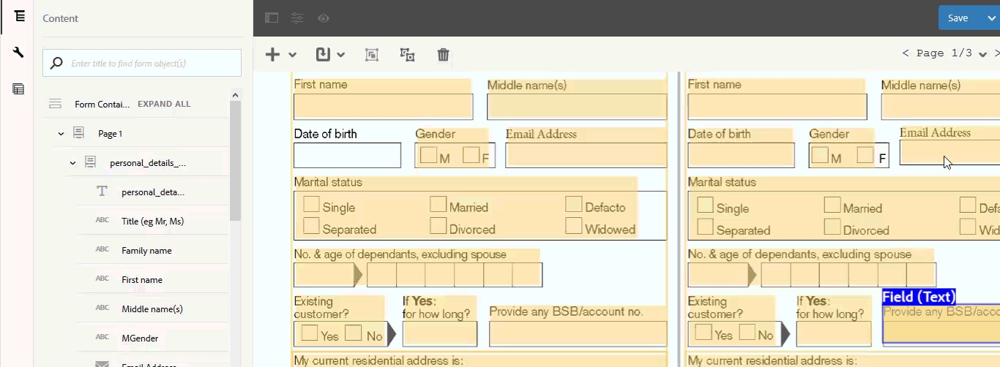

# Überprüfen und Korrigieren konvertierter Formulare{#review-and-correct-converted-forms}

Der Dienst für die automatische Formularkonvertierung von AEM Forms identifiziert Felder, Inhalt und Layout des eingegebenen PDF-Dokuments und konvertiert das PDF-Dokument in ein adaptives Formular. Das adaptive Ausgabeformular kann einige fehlende oder nicht ordnungsgemäß konvertierte Felder enthalten. Sie können mithilfe des Editors „Überprüfen und Korrigieren“ Verbesserungen an identifizierten Feldern vornehmen und das adaptive Formular neu generieren, um ein Ergebnis zu erhalten, das Ihren Erwartungen näher kommt. Nach der ersten Konvertierung können Sie das eingegebene PDF-Dokument im Editor öffnen, um:

* alle Felder und Inhalte anzuzeigen, die während der Konvertierung identifiziert wurden
* die Felder und Inhalte zu identifizieren, die während der Konvertierung übersehen wurden
* den Typ eines Feldes zu überprüfen und gegebenenfalls seinen Typ zu ändern
* die identifizierten Tabellen zu überprüfen, die Größe der Spalten zu ändern und den Zelleninhalt zu ändern
* falsch identifizierte Felder zu entfernen

Nachdem Sie die erforderlichen Änderungen vorgenommen haben, senden Sie die PDF-Formulare erneut an den Konvertierungsdienst. Nach einer erfolgreichen Konvertierung werden die aktualisierten Assets einschließlich des adaptiven Formulars und des Schemas in Ihre AEM Forms-Instanz heruntergeladen. Sie können den Vorgang wiederholen, bis das gewünschte Ergebnis erreicht ist. 

Sie benötigen einen der Browser Google Chrome, Mozilla FireFox oder Microsoft Edge, um den Editor „Überprüfen und Korrigieren“ verwenden zu können. Der Editor unterstützt Internet Explorer nicht.

## Willkommen beim Editor „Überprüfen und Korrigieren“  {#welcome-to-review-and-correct-editor}

Der Editor „Überprüfen und Korrigieren“ bietet eine benutzerfreundliche Oberfläche. Er weist folgende Komponenten auf:

* Inhaltsbrowser: Mit dem Inhaltsbrowser können Sie die Position eines Elements ändern. Mit dem Inhaltsbrowser können Sie ein Formularobjekt per Drag &amp; Drop verschieben, um seine Position zu ändern. Beispiel: Verschieben einer Tabelle vor ein Textfeld. Dies ändert die Tab-Reihenfolge des adaptiven Ausgabeformulars entsprechend.
* Eigenschaftenbrowser: Zeigt die Eigenschaften eines ausgewählten Feldes an. Sie können die Eigenschaften auch ändern.
* Symbolleiste: Die Symbolleiste befindet sich oben im Editor. Es werden Tools zum Hinzufügen, Ändern, Gruppieren, Aufheben der Gruppierung und Löschen von Feldern angezeigt.
* Eigenschaften öffnen: Die Option „Eigenschaften öffnen“ wird angezeigt, wenn Sie auf das Symbol  tippen. Sie können auf „Eigenschaften öffnen“ klicken, um Formulareigenschaften zu öffnen und zusätzliche Optionen anzuzeigen.
* Schaltfläche „Filter“: Die Schaltfläche „Filter“  befindet sich oben im Editor. Sie können die Felder filtern, um nur Texte, Felder, Auswahlgruppen, Bedienfelder oder alle Komponenten anzuzeigen.
* Schaltfläche „Speichern“: Die Schaltfläche **[!UICONTROL Speichern]** befindet sich in der oberen rechten Ecke des Editors. Über den Pfeil neben der Schaltfläche „Speichern“ können Sie auch die Option zum Senden des Formulars zur Konvertierung anzeigen.

* PDF-Formular: Der Editor zeigt das Quell-PDF-Dokument an und überlagert es mit identifizierten Feldern. Sie können die Werkzeuge in der Symbolleiste verwenden, um die Felder zu ändern.
* Seiten: Ein Quellformular kann mehrere Seiten umfassen. In der oberen rechten Ecke des Editors befindet sich eine Schaltfläche, um zwischen den Seiten zu navigieren.

**A.** Inhaltsbrowser **B.** Eigenschaftenbrowser **C.** Symbolleiste **D.** Eigenschaftenschaltfläche **E.** Filterschaltfläche **F.** Schaltfläche „Speichern“ **G.** PDF-Formular mit identifizierten Feldern überlagert

Nach der ersten erfolgreichen Konvertierung überlagert der Konvertierungsdienst das Quell-PDF-Dokument mit identifizierten Feldern und Komponenten. Diese Felder oder Komponenten sind vom Typ: Text, Feld, Bedienfeld, Auswahlgruppe und Tabelle:

* Text: Nur Text im Quell-PDF-Dokument. Zum Beispiel der Kreditantragstext im oben gezeigten Bild.
* Feld: Kombination von Text oder Symbolbezeichnung, die einem Wert oder einem Eingabefeld zugeordnet ist. Zum Beispiel der erste Feldname im obigen Bild. Dies hat eine Textbezeichnung und ein Eingabefeld. Ein Feld unterstützt die Datentypen Text, Zahlen, Dropdown, Datum, E-Mail, Telefonnummer, Signatur, Währung und Kennwort.
* Bedienfeld: Logische Sammlung von Inhalten und Komponenten. Beispiel: Persönliche Details der Bereiche Person 1 und Person 2 im obigen Bild.
* Auswahlgruppe: Kombination von Text mit Multiple-Choice-Optionen: Kontrollkästchen und Optionsfeld. Zum Beispiel Familienstand und Bestehender Kunde im obigen Bild.\
  Basierend auf der Beschriftung der Auswahlgruppe und ihren Multiple-Choice-Optionen konvertiert der Konvertierungsdienst eine Auswahlgruppe automatisch in ein Optionsfeld mit einfacher Auswahl oder ein Kontrollkästchen mit mehrfacher Auswahl. Wenn beispielsweise **Eine Option auswählen** als Auswahlgruppenbeschriftung angegeben ist oder die Multiple-Choice-Optionen nur zulassen, eine einzige Option, **Ja** oder **Nein** zu wählen, konvertiert der Konvertierungsdienst die Auswahlgruppe automatisch in ein Optionsfeld mit Einfachauswahl. In ähnlicher Weise konvertiert der Konvertierungsdienst die Auswahlgruppe automatisch in ein Kontrollkästchen für die Mehrfachauswahl, wenn **Alle zutreffenden auswählen** oder **Mehrere auswählen** als Auswahlgruppenbeschriftung angegeben ist oder die Multiple-Choice-Optionen die Auswahl mehrerer Optionen ermöglichen.

* Tabelle: Eine 2D-Tabelle mit Informationen in Spalten und Zeilen. Sie können einer Tabelle Zeilen oder Spalten hinzufügen oder daraus entfernen.

## Überprüfen einer Konvertierung {#start-reviewing-a-conversion}

Nach der ersten erfolgreichen Konvertierung überlagert der Konvertierungsdienst das Quell-PDF-Dokument mit identifizierten Feldern und Komponenten. Sie können Verbesserungen an identifizierten Feldern vornehmen und das adaptive Formular neu generieren, um ein Ergebnis zu erhalten, das Ihren Erwartungen näher kommt. Sie können mit der Überprüfung einer Konvertierung erst nach der ersten erfolgreichen Konvertierung beginnen.

### Bevor Sie beginnen {#before-you-start}

* Der Editor „Überprüfen und Korrigieren“ unterstützt keine Fragmente. Verwenden Sie den Editor nicht, um Konvertierungen zu überprüfen, bei denen die Option **Fragment extrahieren** während der Konvertierung aktiviert war. Für solche Konvertierungen können Sie den [adaptiven Formulareditor](https://helpx.adobe.com/de/experience-manager/6-5/forms/using/introduction-forms-authoring.html) verwenden.

* Der Editor zum Überprüfen und Korrigieren hat keine Aktion zum Rückgängigmachen. Verwenden Sie die Schaltfläche „Speichern“ nur, um die Änderungen dauerhaft zu speichern.

### Starten einer Überprüfung {#start-the-review}

Um mit der Überprüfung von Konvertierungen zu beginnen, wählen Sie das für die Konvertierung verwendete PDF-Quelldokument aus und tippen Sie auf **Konvertierungen überprüfen**. Der Editor „Überprüfen und Korrigieren“ wird in einer neuen Registerkarte geöffnet. Sie können mit der Überprüfung der Konvertierungen beginnen. Führen Sie die folgenden grundlegenden Überprüfungen durch, bevor Sie andere Probleme beheben:

1. **Typ aller Felder überprüfen**: Der Konvertierungsdienst kann einem Feld einen falschen Typ zuweisen. Beispielsweise wird dem Mobiltelefonfeld der Typ Text anstelle des Typs Telefon zugewiesen. Sie können mit der Maus über ein Feld fahren, um den Feldtyp zu ermitteln.

   Um den Feldtyp zu ändern, wählen Sie das Feld aus, öffnen Sie den Eigenschaftenbrowser, wählen Sie einen Wert aus der Dropdown-Liste **[!UICONTROL Typ]** aus und tippen Sie auf **[!UICONTROL Speichern]**. Der Typ ist geändert.

   

1. **Zusätzliche Bedienfelder entfernen**: Der Konvertierungsdienst kann zusätzliche Bedienfelder generieren. Ein übergeordnetes Bedienfeld könnte beispielsweise ein zusätzliches Unterbedienfeld enthalten oder ein leerer Bereich oder ein Kontrollkästchen könnte in ein Bedienfeld konvertiert worden sein. Überprüfen Sie die Grenzen aller Bedienfelder und entfernen Sie zusätzliche Bedienfelder. Sie können die Schaltfläche Filter  oder den Inhaltsbrowser verwenden, um alle Bedienfelder anzuzeigen.

   Sie können ein Bedienfeld löschen oder die Gruppierung aufheben, um es zu entfernen. Bei Verwendung der Löschoption werden auch die untergeordneten Felder oder Komponenten des Bedienfelds gelöscht:

   * Um ein Bedienfeld zu löschen, wählen Sie das Bedienfeld aus und tippen Sie in der Symbolleiste auf das Symbol Löschen . Tippen Sie im Bestätigungsdialogfeld auf **[!UICONTROL Bestätigen]**. Tippen Sie auf **[!UICONTROL Speichern]**, um die Änderungen zu speichern.

   * Um die Gruppierung für ein Bedienfeld aufzuheben, wählen Sie das Bedienfeld aus und tippen Sie in der Symbolleiste auf das Symbol „Gruppierung aufheben“. Die Gruppierung des Bedienfelds wird aufgehoben und untergeordnete Felder des nicht gruppierten Bedienfelds werden an das übergeordnete Feld angepasst. Klicken Sie auf **[!UICONTROL Speichern]**, um die Änderungen zu speichern.

1. **Logische Textgruppen erstellen**: Überprüfen Sie die identifizierten Texte auf Vollständigkeit und Richtigkeit. Überprüfen Sie auch, ob die Texte logisch in den richtigen Feldern oder Gruppen platziert sind. Beispiel: In einem mehrspaltigen Layout werden die Texte einer logischen Gruppe in eine andere Gruppe eingefügt.

   * Um die Vollständigkeit und Richtigkeit des Textes zu überprüfen, verwenden Sie die Filterschaltfläche , um nur Text anzuzeigen, klicken Sie dann auf jeden Text und überprüfen Sie ihn. Beheben Sie ggf. Rechtschreib-, Tipp- oder Grammatikprobleme.

   * Um dem Formular Text hinzuzufügen, tippen Sie auf die Schaltfläche + und anschließend auf **[!UICONTROL Text]**. Zeichnen Sie das Feld, öffnen Sie den Eigenschaftenbrowser und geben Sie den hinzuzufügenden Text in das Inhaltsfeld ein.

1. **Tabellen überprüfen:** Stellen Sie sicher, dass alle Ränder der Tabelle identifiziert sind. Stellen Sie außerdem sicher, dass der Inhalt der Zellen korrekt identifiziert wird.

   * Verwenden Sie die Option **[!UICONTROL Spalte hinzufügen]** oder **[!UICONTROL Zeile hinzufügen]**, um fehlende Rahmen zu identifizieren.

   * Verwenden Sie zum Entfernen zusätzlicher Rahmen die Option **[!UICONTROL Spalte löschen]** oder **[!UICONTROL Zeile löschen]**.

Tippen Sie nach den erforderlichen Änderungen auf die Schaltfläche **[!UICONTROL Speichern &amp; Konvertieren]**, um die PDF-Formulare erneut an den Konvertierungsdienst zu senden. Jedes Feld wird in eine entsprechende adaptive Feldkomponente umgewandelt. Nach der Konvertierung werden die aktualisierten Assets einschließlich des adaptiven Formulars und des Schemas in Ihre AEM Forms-Instanz heruntergeladen. Abhängig von der Komplexität des Formulars kann es einige Zeit dauern, bis der Dienst die Konvertierung abgeschlossen hat.

Nach Durchführung der grundlegenden Überprüfungen können Sie das Formular überprüfen, um organisationsspezifische Probleme zu beheben. Diese Probleme können unter anderem fehlende Felder betreffen, die hinzugefügt werden müssen. Im Abschnitt [Editor „Überprüfen und Korrigieren“ verwenden](review-correct-ui-edited.md#use-the-review-and-correct-editor-tools) erfahren Sie mehr über alle Tools, die der Editor zur Behebung solcher Probleme bereitstellt.

Sie können auch daran arbeiten, identische Probleme zu erkennen, die in fast allen Ihren Formularen auftreten, und solche Muster an Adobe melden. Verwenden Sie den Editor „Überprüfen und Korrigieren“, bis das gewünschte Ergebnis erreicht ist.

## Verwenden Sie den Editor „Überprüfen und Korrigieren“ {#use-the-review-and-correct-editor-tools}

Der Editor „Überprüfen und Korrigieren“ ermöglicht Folgendes:

* [Hinzufügen einer Komponente zum Formular](review-correct-ui-edited.md#add-a-component-to-the-form)
* [Hinzufügen oder Bearbeiten einer Tabelle](review-correct-ui-edited.md)
* [Typ einer Komponente ändern](review-correct-ui-edited.md#change-type-a-component)

* [Erstellen oder Entfernen eines Bedienfelds](review-correct-ui-edited.md#create-or-remove-a-panel)
* [Löschen eines Bedienfelds oder einer Komponente](review-correct-ui-edited.md#delete-a-panel-or-component)
* [Festlegen von Eigenschaften einer Komponente](review-correct-ui-edited.md#set-properties-of-a-component)
* [Senden eines Formulars zur Konvertierung](review-correct-ui-edited.md#send-a-form-for-conversion)

### Hinzufügen einer Komponente zum Formular {#add-a-component-to-the-form}

Der Konvertierungsdienst identifiziert möglicherweise einige Komponenten des Druckformulars nicht. Beispielsweise könnte eine Komponente für ein **Geburtsdatum** in einem Formular während der Konvertierung nicht identifiziert werden. Sie können das Werkzeug **+** verwenden, um solche Komponenten zu identifizieren. Mit dem Tool können Sie Text-, Feld-, Auswahlgruppen-, Tabellen- und Bedienfeldkomponenten hinzufügen.

Um dem Formular eine Komponente hinzuzufügen, tippen Sie auf **[!UICONTROL +]** und anschließend auf **[!UICONTROL Feld]**. Zeichnen Sie ein Feld mit der Beschriftung und dem Eingabefeld des Feldes. So wird im obigen Beispielbild die Feldkomponente verwendet, um die Beschriftung **Geburtsdatum** und das nachfolgende Wertefeld zum Formular hinzuzufügen. Wenn Sie das Feld zeichnen, identifiziert der Konvertierungsdienst den Feldtyp. Sie können den Feldtyp bei Bedarf im Eigenschaftenbrowser ändern. Öffnen Sie nach dem Erstellen der Komponente den Eigenschaftenbrowser und legen Sie die Eigenschaften der Komponente fest.

Tippen Sie auf die Schaltfläche **[!UICONTROL Speichern]**, um die Änderungen zu speichern, oder verwenden Sie die Schaltfläche **[!UICONTROL Speichern &amp; Konvertieren]**, um die PDF-Formulare erneut an den Konvertierungsdienst zu senden.

### Hinzufügen oder Bearbeiten einer Tabelle {#addedittable}

Bei der Konvertierung werden einige Zellen, Grenzen oder Inhalte einer Tabellenzelle eventuell nicht identifiziert. Beispielsweise wird eine Zeile einer Tabelle nicht identifiziert. Sie können den Editor „Überprüfen und Korrigieren“ verwenden, um solche Elemente zu identifizieren. Sie können für eine Tabelle die folgenden Aktionen ausführen:

* Um eine Tabelle auszuwählen, klicken Sie auf eine beliebige Zelle der Tabelle.
* Doppelklicken Sie auf eine Zelle, um Eigenschaften einer Zelle wie Name, Titel oder Typ zu ändern. Sie können auch auf die Zelle doppelklicken, um den Inhalt zu ändern, ein Feld als erforderlich zu markieren und andere Eigenschaften auszuwählen.
* Zum Hinzufügen/Identifizieren einer völlig unidentifizierten oder neuen Tabelle im Formular, verwenden Sie das Werkzeug **[!UICONTROL +]**.
* Um die Größe von Zellen oder Zeilen einer Tabelle zu ändern, klicken Sie einfach auf den leeren Bereich der Tabelle und bewegen Sie den Mauszeiger über die Zeilen- oder Spaltengrenze. Wenn sich der Cursorzeiger ändert, wählen Sie die Grenze aus und verschieben Sie sie. Klicken Sie nach dem Ändern der Größe auf **[!UICONTROL Fertig]**, um die Änderungen zu übernehmen. Sie können die Taste **[!UICONTROL ESC]** drücken, um die Größenänderung zu verwerfen.

* Um Zeilen oder Spalten hinzuzufügen oder zu löschen, wählen Sie eine Zelle in der Zeile der Tabelle aus und wählen Sie **[!UICONTROL Zeile hinzufügen]**, **[!UICONTROL Spalte hinzufügen]**, **[!UICONTROL Zeile löschen]** oder **[!UICONTROL Spalt löschen]** aus dem Menü .

* Um eine Zelle in einer Tabelle zu teilen, wählen Sie die Option **[!UICONTROL Senkrecht teilen]** oder **[!UICONTROL Waagerecht teilen]** aus dem Menü .

* Um Zellen einer Tabelle zusammenzuführen, wählen Sie die zusammenzuführenden Zellen aus und wählen Sie die Option **[!UICONTROL Zellen zusammenführen]** im Tabellenmenü .

### Typ einer Komponente ändern {#change-type-a-component}

Der Konvertierungsdienst erstellt eventuell einige Felder vom falschen Typ. In der folgenden Abbildung wird das Feld **Geschlecht** beispielsweise fälschlicherweise als **Text**-Feld identifiziert. Auch der Inhalt der Beschriftung ist falsch. Das Feld sollte ein Auswahlfeld sein und die Bezeichnung sollte „Geschlecht“ sein. So ändern Sie den Typ einer Komponente und korrigieren die Beschriftung:

Wählen Sie das zu konvertierende Feld aus, tippen Sie auf  und anschließend auf einen Feldtyp. Das Feld wird in den ausgewählten Feldtyp konvertiert. Ein Feld kann nur in die in der folgenden Tabelle aufgeführten Typen konvertiert werden. Eine Bedienfeld-Komponente kann nicht transformiert werden, es ist nur möglich, ihre Gruppierung aufzuheben.

| **Komponente** | **Konvertiert zu** |
|---|---|
| Text | Feld oder Auswahlgruppe |
| Feld | Text oder Auswahlgruppe |
| Auswahlgruppe | Text oder Bedienfeld |

Öffnen Sie nach der Konvertierung den Eigenschaftenbrowser, geben Sie die Bezeichnung an und geben Sie andere erforderliche Eigenschaften an. Tippen Sie auf die Schaltfläche **[!UICONTROL Speichern]**, um die Änderungen zu speichern, oder verwenden Sie die Schaltfläche Speichern &amp; Konvertieren, um die PDF-Formulare erneut an den Konvertierungsdienst zu senden.

### Erstellen oder Entfernen eines Bedienfelds {#create-or-remove-a-panel}

Der Konvertierungsdienst fasst verwandte Komponenten und Inhalte von Druckformularen zu einem Bedienfeld zusammen. Das Formular kann beispielsweise ein Bedienfeld für die Adresse mit Feldern wie Name, Grundstücksnummer, Gebiet, Stadt, Bundesland, Postleitzahl und Land enthalten. Diese Felder sind in einem Bedienfeld zusammengefasst. Ein Formular kann mehrere Bedienfelder enthalten.

Der Konvertierungsdienst erstellt eventuell Bedienfelder, deren Komponenten keine Beziehung zu anderen haben, oder lässt eine zugehörige Komponente im Bedienfeld aus. Sie können die Gruppen- oder Gruppierungstools verwenden, um solche Bedienfelder zu reparieren:

* Um ein Bedienfeld zu entfernen, wählen Sie das Bedienfeld aus und tippen Sie auf . Das Bedienfeld wird entfernt und die untergeordneten Komponenten des Bedienfelds werden in die übergeordnete Komponente verschoben. Sie können auch die Option [Komponente löschen](review-correct-ui-edited.md#delete-a-panel-or-component) verwenden, um sowohl ein Bedienfeld als auch seine untergeordneten Elemente zu löschen.

* Verwenden Sie zum Erstellen eines Bedienfelds die Strg-Taste (unter Windows oder Linux) oder die Control-Taste (unter Mac), um zusammengehörige Komponenten auszuwählen, und tippen Sie auf , um ein Bedienfeld zu erstellen. Öffnen Sie den Eigenschaftenbrowser, um die Eigenschaften des Bedienfelds anzugeben.

Tippen Sie auf die Schaltfläche **[!UICONTROL Speichern]**, um die Änderungen zu speichern, oder verwenden Sie die Schaltfläche **[!UICONTROL Speichern &amp; Konvertieren]**, um die PDF-Formulare erneut an den Konvertierungsdienst zu senden.

### Löschen eines Bedienfelds oder einer Komponente {#delete-a-panel-or-component}

Der Konvertierungsdienst identifiziert eventuell einige falsche Bedienfelder oder Komponenten. Die meisten dieser Komponenten dieser Bedienfelder sind nicht miteinander verbunden. Sie können solche Bedienfelder oder Komponenten löschen.

Um ein Bedienfeld oder eine Komponente zu löschen, wählen Sie das Bedienfeld oder die Komponente aus und tippen Sie auf das Symbol zum Löschen . Tippen Sie im Bestätigungsdialogfeld auf **[!UICONTROL Bestätigen]**. Das ausgewählte Bedienfeld oder die ausgewählte Komponente wird gelöscht. Beim Löschen eines Bedienfelds werden auch alle untergeordneten Elemente des Bedienfelds gelöscht. Sie können die Strg-Taste (unter Windows oder Linux) oder die Control-Taste (unter Mac) verwenden, um mehrere Komponenten oder Bedienfelder auszuwählen.

### Festlegen von Eigenschaften einer Komponente {#set-properties-of-a-component}

Jede Komponente des Formulars verfügt über eine Reihe von Eigenschaften wie Name, Titel und Typ. Um die Eigenschaften einer Komponente festzulegen, wählen Sie die Komponente aus und tippen Sie auf den Eigenschaftenbrowser. Die Eigenschaften der ausgewählten Komponente werden angezeigt. Ändern Sie die Eigenschaften oder legen Sie sie fest.

Tippen Sie auf die Schaltfläche **[!UICONTROL Speichern]**, um die Änderungen zu speichern, oder verwenden Sie die Schaltfläche **[!UICONTROL Speichern &amp; Konvertieren]**, um die PDF-Formulare erneut an den Konvertierungsdienst zu senden.

### Senden eines Formulars zur Konvertierung {#send-a-form-for-conversion}

Nachdem Sie alle erforderlichen Änderungen im Editor „Überprüfen und Korrigieren“ vorgenommen haben, können Sie das Formular erneut zur Konvertierung senden. Um das Formular zur Konvertierung zu senden, tippen Sie auf **[!UICONTROL Speichern &amp; Konvertieren]**. Der Ordner, der das Quelldokument enthält, erhält die **[!UICONTROL Bezeichnung „Zur Konvertierung gesendet“]** und das aktualisierte Quellformular wird zum Konvertierungsdienst hochgeladen, der auf Adobe I/O läuft.

Je nach Komplexität des Formulars benötigt der Konvertierungsdienst einige Zeit, um das Formular zu konvertieren. Nach Abschluss der Konvertierung werden das konvertierte adaptive Formular und die zugehörigen Assets auf Ihren Computer heruntergeladen. Sie können das Formular nach Abschluss der Konvertierung im Editor überprüfen und das adaptive Formular im [Editor für adaptive Formulare](https://helpx.adobe.com/de/experience-manager/6-5/forms/using/introduction-forms-authoring.html) öffnen, um bei Bedarf die endgültigen Korrekturen durchzuführen.

Wenn Sie ein Formular erneut zur Konvertierung senden, nachdem Sie das Formular im Editor für adaptive Formulare aktualisiert haben, gehen alle im adaptiven Formular vorgenommenen Änderungen verloren. Sie können ein Formular im Editor „Überprüfen und Korrigieren“ erst nach einer erfolgreichen Konvertierung öffnen.

<!--
Comment Type: draft

<h3>Open adaptive forms editor</h3>
-->

<!--
Comment Type: draft

There can be instances where you require adaptive forms editor to make the changes like, applying a different theme to the form or fixing tables. Once you have made all the required changes in Review and Correct editor and converted the form, you can open your form in adaptive forms editor to make the final set of changes.

To open the form with adaptive forms editor, tap the  icon, and tap <strong>Open Adaptive Form Editor</strong>. The form opens in adaptive form editor. 

## Previous {#previous}

[Use Automated Forms Conversion service](convert-existing-forms-to-adaptive-forms.md)
-->
