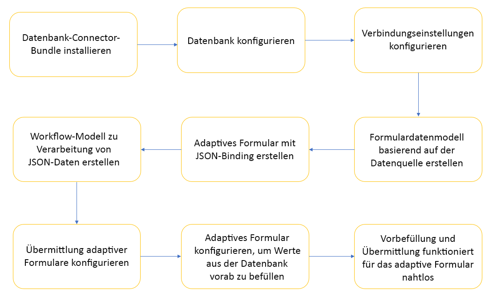

# Integrieren des adaptiven Formulars mithilfe des AEM-Workflows in die Datenbank {#submit-forms-to-database-using-forms-portal}

Mit dem Dienst zur automatischen Formularkonvertierung können Sie ein nicht-interaktives PDF-Formular, ein Acro Form oder ein XFA-basiertes PDF-Formular in ein adaptives Formular konvertieren. Während Sie den Konvertierungsprozess starten, haben Sie die Möglichkeit, ein adaptives Formular mit oder ohne Datenbindung zu generieren.

Wenn Sie ein adaptives Formular ohne Datenbindungen generieren möchten, können Sie nach der Konvertierung das adaptive Formular in ein Formulardatenmodell, ein XML-Schema oder ein JSON-Schema integrieren. Für das Formulardatenmodell müssen Sie die Felder des adaptiven Formulars manuell mit dem Formulardatenmodell verknüpfen. Wenn Sie jedoch ein adaptives Formular mit Datenbindungen generieren, ordnet der Konvertierungsdienst die adaptiven Formulare automatisch einem JSON-Schema zu und erstellt eine Datenbindung zwischen den im adaptiven Formular und im JSON-Schema verfügbaren Feldern. Anschließend können Sie das adaptive Formular in eine Datenbank Ihrer Wahl integrieren, Daten in das Formular eintragen und dieses über das Formularportal an die Datenbank senden. Ebenso können Sie nach erfolgreicher Integration in die Datenbank Felder im konvertierten adaptiven Formular konfigurieren, um Werte aus der Datenbank abzurufen und Felder des adaptiven Formulars vorab auszufüllen.

Die folgende Abbildung zeigt verschiedene Phasen der Integration eines konvertierten adaptiven Formulars in eine Datenbank:



Dieser Artikel gibt Anweisungen zu den einzelnen Schritten für die erfolgreiche Ausführung all dieser Integrationsstufen.

## Voraussetzungen {#pre-requisites}

* Eine AEM 6.4 oder 6.5 Author-Instanz einrichten
* Installieren Sie das [neueste Service Pack](https://helpx.adobe.com/experience-manager/aem-releases-updates.html) für Ihre AEM-Instanz
* Neueste Version des AEM Forms-Add-On-Pakets
* Konfigurieren Sie den [Dienst für die automatische Formularkonvertierung](configure-service.md)
* Richten Sie eine Datenbank ein. Die in der Beispielimplementierung verwendete Datenbank ist MySQL 5.6.24. Sie können das konvertierte adaptive Formular jedoch in jede beliebige Datenbank Ihrer Wahl integrieren.

## Beispiel für ein adaptives Formular {#sample-adaptive-form}

Laden Sie die folgende PDF-Beispieldatei herunter, um den Anwendungsfall zum Integrieren konvertierter adaptiver Formulare in die Datenbank mithilfe eines AEM-Arbeitsablaufs auszuführen.

Sie können das Beispiel-Kontaktformular herunterladen mit:

[Datei abrufen](assets/sample_contact_us_form.pdf)

Die PDF-Datei dient als Eingabe für den Dienst zur automatischen Formularkonvertierung. Der Dienst konvertiert diese Datei in ein adaptives Formular. Das folgende Bild zeigt das Beispiel eines Kontaktformulars im PDF-Format.


## Installieren der Datei mysql-connector-java-5.1.39-bin.jar {#install-mysql-connector-java-file}

Führen Sie die folgenden Schritte auf allen Autoren- und Veröffentlichungsinstanzen aus, um die Datei mysql-connector-java-5.1.39-bin.jar zu installieren:

1. Navigieren Sie zu `http://server:port/system/console/depfinder` und suchen Sie nach dem com.mysql.jdbc-Paket.
1. Überprüfen Sie in der Spalte „Exportiert von“, ob das Paket von einem Paket exportiert wird. Fahren Sie fort, wenn das Paket nicht von einem Paket exportiert wird.
1. Navigieren Sie zu `http://server:port/system/console/bundles` und klicken Sie auf **[!UICONTROL Installieren/Aktualisieren]**.
1. Klicken Sie auf **[!UICONTROL Datei auswählen]** und wählen Sie die Datei mysql-connector-java-5.1.39-bin.jar. Aktivieren Sie außerdem die Kontrollkästchen **[!UICONTROL Paket starten]** und **[!UICONTROL Paket aktualisieren]**.
1. Klicken Sie auf **[!UICONTROL Installieren]** oder **[!UICONTROL Aktualisieren]**. Wenn dies abgeschlossen ist, starten Sie den Server neu.
1. (Nur Windows) Deaktivieren Sie die System-Firewall für Ihr Betriebssystem.

## Vorbereiten der Daten für das Formularmodell {#prepare-data-for-form-model}

Mit der AEM Forms-Datenintegration können Sie unterschiedliche Datenquellen konfigurieren und Verbindungen zu ihnen herzustellen. Nach dem Generieren eines adaptiven Formulars mithilfe des Konvertierungsprozesses können Sie das Formularmodell basierend auf einem Formulardatenmodell, XSD oder einem JSON-Schema definieren. Sie können eine Datenbank, Microsoft Dynamics oder einen anderen Dienst eines Drittanbieters verwenden, um ein Formulardatenmodell zu erstellen.

In diesem Lernprogramm wird die MySQL-Datenbank als Quelle zum Erstellen eines Formulardatenmodells verwendet. Erstellen Sie ein Schema in der Datenbank und fügen Sie dem Schema eine **contactus**-Tabelle hinzu, basierend auf den Feldern, die im adaptiven Formular verfügbar sind.


Mit der folgenden DDL-Anweisung können Sie die Tabelle **contactus** in der Datenbank erstellen.

```sql
CREATE TABLE `contactus` (
   `name` varchar(45) NOT NULL,
   `email` varchar(45) NOT NULL,
   `phonenumber` varchar(10) DEFAULT NULL,
   `issuedesc` varchar(1000) DEFAULT NULL,
   PRIMARY KEY (`email`)
 ) ENGINE=InnoDB DEFAULT CHARSET=utf8
```

## Konfigurieren der Verbindung zwischen der AEM-Instanz und der Datenbank {#configure-connection-between-aem-instance-and-database}

Führen Sie die folgenden Konfigurationsschritte aus, um eine Verbindung zwischen der AEM-Instanz und der MYSQL-Datenbank herzustellen:

1. Navigieren Sie zur AEM Web Console-Konfigurationsseite unter `http://server:port/system/console/configMgr`.
1. Klicken und öffnen Sie **[!UICONTROL Apache Sling Connection Pooled DataSource]** im Bearbeitungsmodus in der Web Console-Konfiguration. Geben Sie die Werte für die Eigenschaften an, wie in der folgenden Tabelle beschrieben:

   <table> 
    <tbody> 
    <tr> 
    <th><strong>Eigenschaft</strong></th> 
    <th><strong>Wert</strong></th> 
    </tr> 
    <tr> 
    <td><p>Datenquellenname</p></td> 
    <td><p>Ein Datenquellenname zum Filtern von Treibern aus dem Datenquellen-Pool.</p></td>
    </tr>
    <tr> 
    <td><p>JDBC-Treiberklasse</p></td> 
    <td><p>com.mysql.jdbc.Driver</p></td>
    </tr>
    <tr> 
    <td><p>JDBC-Verbindungs-URI</p></td> 
    <td><p>jdbc:mysql://[Host]:[Anschluss]/[Schemaname]</p></td>
    </tr>
    <tr> 
    <td><p>Benutzername</p></td> 
    <td><p>Benutzername zur Authentifizierung und Durchführung von Aktionen für Datenbanktabellen</p></td>
    </tr>
    <tr> 
    <td><p>Kennwort</p></td> 
    <td><p>Kennwort für den Benutzernamen</p></td>
    </tr>
    <tr> 
    <td><p>Transaktionsisolation</p></td> 
    <td><p>READ_COMMITTED</p></td>
    </tr>
    <tr> 
    <td><p>Max. aktive Verbindungen</p></td> 
    <td><p>1.000</p></td>
    </tr>
    <tr> 
    <td><p>Max. inaktive Verbindungen</p></td> 
    <td><p>100</p></td>
    </tr>
    <tr> 
    <td><p>Min. inaktive Verbindungen</p></td> 
    <td><p>10</p></td>
    </tr>
    <tr> 
    <td><p>Anfangsgröße</p></td> 
    <td><p>10</p></td>
    </tr>
    <tr> 
    <td><p>Max. Wartezeit</p></td> 
    <td><p>100000</p></td>
    </tr>
     <tr> 
    <td><p>Borgentest</p></td> 
    <td><p>Aktiviert</p></td>
    </tr>
     <tr> 
    <td><p>Testen beim Leerlauf</p></td> 
    <td><p>Aktiviert</p></td>
    </tr>
     <tr> 
    <td><p>Überprüfungsabfrage</p></td> 
    <td><p>Beispielwerte sind SELECT 1(mysql), select 1 from dual(oracle), SELECT 1(MS Sql Server) (validationQuery)</p></td>
    </tr>
     <tr> 
    <td><p>Validation Query Timeout</p></td> 
    <td><p>10000</p></td>
    </tr>
    </tbody> 
    </table>

## Erstellen eines Formulardatenmodells {#create-form-data-model}

Führen Sie nach dem Konfigurieren von MYSQL als Datenquelle die folgenden Schritte aus, um ein Formulardatenmodell zu erstellen:

1. Navigieren Sie in der AEM-Autoreninstanz zu **[!UICONTROL Formulare]** > **[!UICONTROL Datenintegration]**.

1. Tippen Sie auf **[!UICONTROL Erstellen]** > **[!UICONTROL Formulardatenmodell]**.

1. Geben Sie im Assistenten **[!UICONTROL Formulardatenmodell erstellen]** **workflow_submit** als Namen für das Formulardatenmodell ein. Tippen Sie auf **[!UICONTROL Weiter]**.

1. Wählen Sie die MYSQL-Datenquelle aus, die Sie im vorherigen Abschnitt konfiguriert haben, und tippen Sie auf **[!UICONTROL Erstellen]**.

1. Tippen Sie auf **[!UICONTROL Bearbeiten]** und erweitern Sie die im linken Bereich aufgeführte Datenquelle, um die **contactus**-Tabelle und die Dienste **[!UICONTROL get]** und **[!UICONTROL insert]** auszuwählen, und wählen Sie **[!UICONTROL Ausgewählte hinzufügen]**.

   

1. Wählen Sie das Datenmodellobjekt im rechten Bereich aus und tippen Sie auf **[!UICONTROL Eigenschaften bearbeiten]**. Wählen Sie die Dienste **[!UICONTROL get]** und **[!UICONTROL insert]** aus den Dropdown-Listen **[!UICONTROL Read-Dienst]** und **[!UICONTROL Write-Dienst]** aus. Geben Sie die Argumente für den Read-Dienst an und tippen Sie auf **[!UICONTROL Fertig]**.

1. Wählen Sie auf der Registerkarte **[!UICONTROL Dienste]** den Dienst **[!UICONTROL get]** und tippen Sie auf **[!UICONTROL Eigenschaften bearbeiten]**. Wählen Sie das **[!UICONTROL Ausgabemodellobjekt]**, deaktivieren Sie den Schalter **[!UICONTROL Rückgabe-Array]** und tippen Sie auf **[!UICONTROL Fertig]**.

1. Wählen Sie den Dienst **[!UICONTROL insert]** und tippen Sie auf **[!UICONTROL Eigenschaften bearbeiten]**. Wählen Sie das **[!UICONTROL Eingabemodellobjekt]** und tippen Sie auf **[!UICONTROL Fertig]**.

1. Tippen Sie auf **[!UICONTROL Speichern]**, um das Formulardatenmodell zu speichern.

Sie können das Beispiel-Formulardatenmodell wie folgt herunterladen:

[Datei abrufen](assets/DownloadedFormsPackage_1497728018502500.zip)

## Generieren adaptiver Formulare mit JSON-Bindung {#generate-adaptive-forms-with-json-binding}

Verwenden Sie den [Dienst für die automatische Formularkonvertierung](convert-existing-forms-to-adaptive-forms.md) zum Konvertieren des [Kontaktformulars](#sample-adaptive-form) in ein adaptives Formular mit Datenbindung. Stellen Sie sicher, dass Sie nicht das Kontrollkästchen **[!UICONTROL Adaptive(s) Formular(e) ohne Datenbindungen generieren]** aktivieren, während das adaptive Formular generiert wird.


Wählen Sie das konvertierte **Kontaktformular** aus, das im Ordner **[!UICONTROL Ausgabe]** unter **[!UICONTROL Formulare und Dokumente]** verfügbar ist, und tippen Sie auf **[!UICONTROL Bearbeiten]**. Tippen Sie auf **[!UICONTROL Vorschau]**, geben Sie Werte in die Felder des adaptiven Formulars ein und tippen Sie auf **[!UICONTROL Senden]**.

Melden Sie sich bei **crx-repository** an und navigieren Sie zu */content/forms/fp/admin/submit/data*, um die übermittelten Werte im JSON-Format anzuzeigen. Im Folgenden werden die Beispieldaten im JSON-Format gezeigt, wenn Sie das konvertierte adaptive **Kontaktformular** senden:

```json
{
  "afData": {
    "afUnboundData": {
      "data": {}
    },
    "afBoundData": {
      "data": {
        "name1": "Gloria",
        "email": "abc@xyz.com",
        "phone_number": "2346578965",
        "issue_description": "Test message"
      }
    },
    "afSubmissionInfo": {
      "computedMetaInfo": {},
      "stateOverrides": {},
      "signers": {},
      "afPath": "/content/dam/formsanddocuments/docs_conversion/output/sample_form_json",
      "afSubmissionTime": "20191204014007"
    }
  }
}
```

Sie müssen jetzt ein Arbeitsablaufmodell erstellen, das diese Daten verarbeiten und über das in den vorherigen Abschnitten erstellte Formulardatenmodell an die MYSQL-Datenbank senden kann.

## Erstellen Sie ein Arbeitsablaufmodell zur Verarbeitung von JSON-Daten {#create-workflow-model}

Führen Sie die folgenden Schritte aus, um ein Arbeitsablaufmodell zum Senden der adaptiven Formulardaten an die Datenbank zu erstellen:

1. Öffnen Sie die Konsole für Arbeitsablaufmodelle. Die Standardeinstellung ist `https://server:port/libs/cq/workflow/admin/console/content/models.html/etc/workflow/models`.

1. Wählen Sie dann **[!UICONTROL Erstellen]** und dann **[!UICONTROL Modell erstellen]** aus. Das Dialogfeld **[!UICONTROL Arbeitsablaufmodell hinzufügen]** wird angezeigt.

1. Geben Sie den **[!UICONTROL Titel]** und den **[!UICONTROL Namen]** ein (optional). Zum Beispiel **workflow_json_submit**. Tippen Sie auf **[!UICONTROL Fertig]**, um das Modell zu erstellen.

1. Wählen Sie das Arbeitsablaufmodell aus und tippen Sie auf **[!UICONTROL Bearbeiten]**, um das Modell im Bearbeitungsmodus zu öffnen. Tippen Sie auf + und fügen Sie dem Arbeitsablaufmodell den Schritt **[!UICONTROL Formulardatenmodelldienst aufrufen]** hinzu.

1. **[!UICONTROL Tippen Sie auf den Schritt Formulardatenmodelldienst aufrufen]** and und anschließend auf .

1. Wählen Sie auf der Registerkarte ]**Formulardatenmodell**[!UICONTROL  das Formulardatenmodell, das Sie im Feld **[!UICONTROL Formulardatenmodellpfad]** angelegt haben, und wählen Sie **[!UICONTROL insert]** aus der Dropdown-Liste **[!UICONTROL Dienst]**.

1. Wählen Sie auf der Registerkarte **[!UICONTROL Eingabe für Dienst]** die Option **[!UICONTROL Eingabedaten mithilfe von Literal- , Variablen- oder Arbeitsablauf-Metadaten und einer JSON-Datei bereitstellen]** aus der Dropdown-Liste, aktivieren Sie das Kontrollkästchen **[!UICONTROL Eingabefelder aus Eingabe-JSON zuordnen]** und aktivieren Sie **[!UICONTROL Relativ zur Nutzlast]** und geben Sie **data.xml** als Wert für das Feld **[!UICONTROL JSON-Eingabedokument auswählen mit]** an.

1. Geben Sie im Abschnitt **[!UICONTROL Dienstargumente]** die folgenden Werte für die Formulardatenmodellargumente ein:

   

   Beachten Sie, dass die Formulardatenmodellfelder, z. B. contactus Punkt Name dem **afData.afBoundData.data.name1** zugeordnet werden, das auf die JSON-Schemabindungen für das gesendete adaptive Formular verweist.

## Konfigurieren der Übermittlung des adaptiven Formulars {#configure-adaptive-form-submission}

Führen Sie die folgenden Schritte aus, um das adaptive Formular an das Arbeitsablaufmodell zu senden, das Sie im vorherigen Abschnitt erstellt haben:

1. Wählen Sie das konvertierte Kontaktformular aus, das im Ordner **[!UICONTROL Ausgabe]** unter **[!UICONTROL Formulare und Dokumente]** verfügbar ist, und tippen Sie auf **[!UICONTROL Bearbeiten]**.

1. Öffnen Sie die Eigenschaften des adaptiven Formulars, indem Sie auf **[!UICONTROL Formularcontainer]** und anschließend auf  tippen.

1. Wählen Sie im Abschnitt **[!UICONTROL Übermittlung]** die Option **[!UICONTROL AEM-Arbeitsablauf aufrufen]** aus der Dropdown-Liste **[!UICONTROL Übermittlungsaktion]**, wählen Sie das Arbeitsablaufmodell, das Sie im vorherigen Abschnitt erstellt haben, und geben Sie **data.xml** im Feld **[!UICONTROL Datendateipfad]** an.

1. Tippen Sie auf , um die Eigenschaften zu speichern.

1. Tippen Sie auf **[!UICONTROL Vorschau]**, geben Sie Werte in die Felder des adaptiven Formulars ein und tippen Sie auf **[!UICONTROL Senden]**. Die übermittelten Werte werden jetzt in der MYSQL-Datenbanktabelle anstelle von **crx-repository** angezeigt.

## Konfigurieren des adaptiven Formulars, um Werte aus der Datenbank vorab auszufüllen

Führen Sie die folgenden Schritte aus, um das adaptive Formular so zu konfigurieren, dass Werte aus der MYSQL-Datenbank basierend auf dem in der Tabelle definierten Primärschlüssel (in diesem Fall E-Mail) vorab ausgefüllt werden:

1. Tippen Sie im adaptiven Formular auf das Feld **E-Mail** und anschließend auf .

1. Tippen Sie auf **[!UICONTROL Erstellen]** und wählen Sie **[!UICONTROL Wird geändert]** aus der Dropdown-Liste **[!UICONTROL Status auswählen]** im Abschnitt **[!UICONTROL Wenn]**.

1. Wählen Sie im Abschnitt **[!UICONTROL Dann]** die Option **[!UICONTROL Dienst aufrufen]** und **get** als Dienst für das Formulardatenmodell, das Sie in einem vorherigen Abschnitt dieses Artikels erstellt haben.

1. Wählen Sie **E-Mail** im Abschnitt **[!UICONTROL Eingabe]** und die anderen drei Felder des Formulardatenmodells: **Name**, **Telefonnummer** und **Problembeschreibung** im Abschnitt **[!UICONTROL Ausgabe]**. Tippen Sie auf **[!UICONTROL Fertig]**, um die Einstellungen zu speichern.

   

   Basierend auf vorhandenen E-Mail-Einträgen in der MYSQL-Datenbank können Sie daher die Werte für die restlichen drei Felder im Modus **[!UICONTROL Vorschau]** des adaptiven Formulars im Voraus ausfüllen lassen. Wenn Sie beispielsweise aya.tan@xyz.com im Feld **E-Mail** angeben (basierend auf den vorhandenen Daten gemäß Abschnitt [Formulardatenmodell vorbereiten](#prepare-data-for-form-model) dieses Artikels) und das Feld mit der Tabulatortaste verlassen, werden die restlichen drei Felder, **Name**, **Telefonnummer** und **Problembeschreibung** automatisch im adaptiven Formular angezeigt.

Sie können das konvertierte adaptive Formular herunterladen mit:

[Datei abrufen](assets/DownloadedFormsPackage_1498226829041200.zip)
